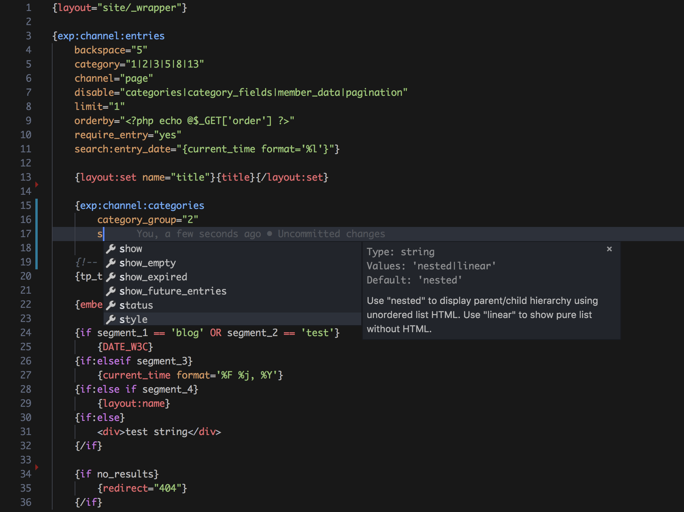

# ExpressionEngine syntax highlighting

Enables syntax highlighting for ExpressionEngine's templating language, including HTML and PHP code.

## Release Notes

### 0.0.2

Remove space from name

### 0.0.1

Initial release